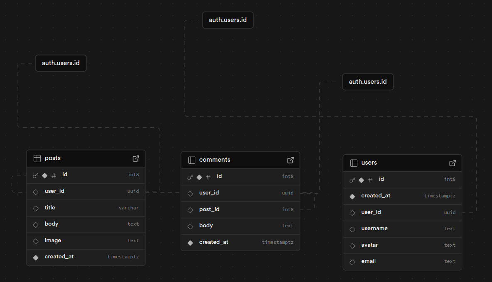
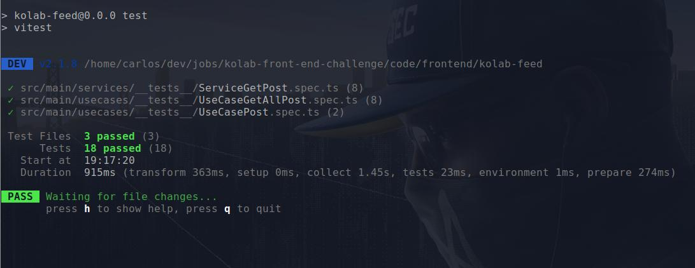
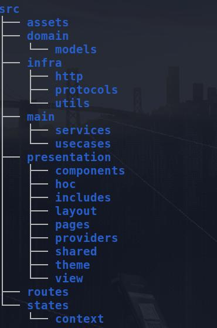

    

# :rocket: Kolab-Feed Web App

Feed de Posts dinâmico para visualização e interação com conteúdos em tempo real.

:globe_with_meridians: __Demo__: [acesse aqui](https://kolab-feed.vercel.app)

## :gear: Funcionalidades

- [x] Feed: Listagem de Posts de usuários
- [x] Pagina de Post por usuário
- [x] Gerenciamento
  - [x] Post
  - [x] Comentário
  - [x] Usuário - Perfil
- [x] Paginas
  - [x] Feed
  - [x] Posts(Geral e por usuário)
  - [x] Perfil
- [ ] Autenticação
  - [x] Sign in(Login)
  - [x] Sign out(Logout)
  - [ ] Sign up(Cadastro)
- [ ] Busca Geral
  - [ ] Título e Post

## :floppy_disk: Modelagem

## :clipboard: Testes

## :triangular_ruler: Arquitetura - Clean Arch

## :electric_plug: Tecnologias

- TypeScript
- React
- React Router
- Styled-Components
- Chakra UI
- Supabase
- TanStack

## :electric_plug: Instalação

...